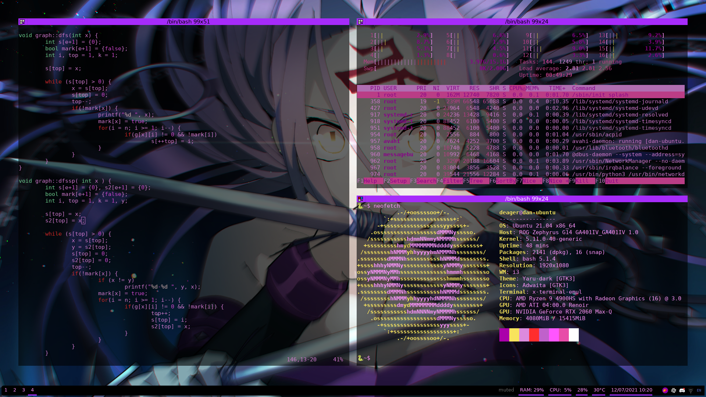

My personal Linux desktop enviroment. Combines a variety of tools to my liking. 
Themed after the character Rider, from Fate/Stay Night. 
Credit to artwork: https://www.pixiv.net/en/artworks/84216107  

Example: 

 
The install.sh scripts installs and configures:
- bash
- i3
- git
- neovim
- polybar
- terminator
- rofi
- htop
- tmux
- neofetch
- xcompmgr
- feh
